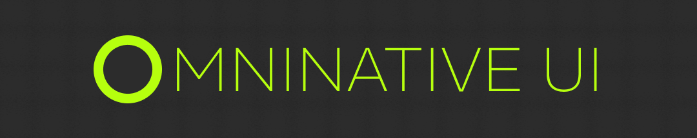
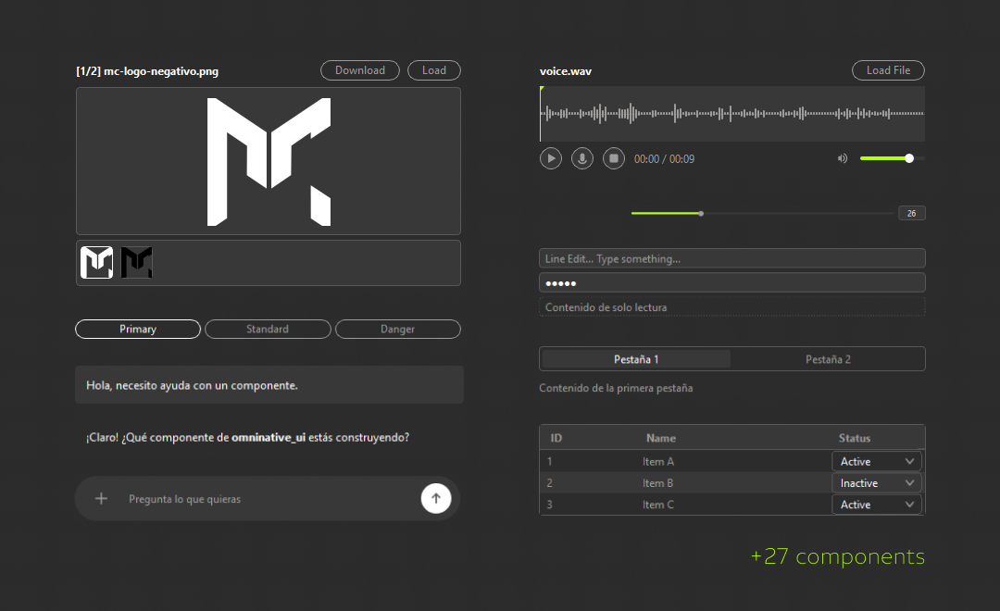

# OmniNative UI

[](https://pypi.org/project/omninative-ui/)
[](https://pypi.org/project/omninative-ui/)
[](https://github.com/rgcodeai/omninative-ui/blob/main/LICENSE)

<!-- Banner Principal -->
<p align="center">
  
</p>

**OmniNative UI** is a comprehensive, modern UI component library built on top of **PySide6**. It provides a fully unified, premium dark theme out of the box, allowing developers to create sleek, professional desktop applications with minimal styling effort. 

## ✨ Features
- **Premium Dark Theme:** Pre-configured styling so you don't have to write any QSS/CSS.
- **Rich Component Library:** 20+ ready-to-use widgets including core inputs, virtual tables, interactive multimedia players, and a chat interface.
- **Pythonic API:** Intuitive wrappers around PySide6 that simplify layout management.
- **Native OS Integration:** Smooth behavior across Windows, macOS, and Linux without losing the custom aesthetic.

<!-- Showcase de Componentes -->
<p align="center">
  
</p>

## 🚀 Installation

Install the package directly from PyPI:

```bash
pip install omninative-ui
```

### Installing from Source (Development)

If you want to contribute or modify the library locally:

```bash
git clone https://github.com/your-username/omninative-ui.git
cd omninative-ui
pip install -e .
```

## 💻 Quick Start

```python
import sys
from PySide6.QtWidgets import QApplication
from omninative_ui import OWindow, OGroup, OButton, OLabel

app = QApplication(sys.argv)

window = OWindow(title="My App", width=400, height=300)

group = OGroup(window.body, orientation="v")
window.body.layout().addWidget(group)

group.layout_.addWidget(OLabel(group, text="Hello World", bright=True))
group.layout_.addWidget(OButton(group, text="Click Me", primary=True))

window.omninativeui_reveal_when_ready()
window.show()
sys.exit(app.exec())
```

## 📖 Documentation

For full API references, architecture guides, and instructions on how to create new components, please check the [Full Documentation (`/docs/INDEX.md`)](docs/INDEX.md).

## 🧩 Components

### Core
| Component | Description |
| :--- | :--- |
| `OWindow` | Top-level window with OmniNative theme |
| `OGroup` | Vertical/horizontal layout container |
| `OLabel` | Styled text label |
| `OElidedLabel` | Auto-eliding text label |
| `OSectionHeader` | Section heading |
| `OSeparator` | Horizontal separator line |
| `OButton` | Button with primary/danger variants |
| `OComboBox` | Custom styled dropdown |
| `ORadioButton` | Radio button with icon positioning |
| `OCheckBox` | Custom styled checkbox |
| `OStatusBar` | Status bar label |
| `OOptionRow` | Label + widget row layout |

### Inputs
| Component | Description |
| :--- | :--- |
| `OLineEdit` | Single-line text input |
| `OTextBox` | Multi-line text input |
| `OSpinBox` | Numeric input with +/- buttons |
| `OSlider` | Slider with value display |
| `OProgressBar` | Progress indicator |

### Containers
| Component | Description |
| :--- | :--- |
| `OScrollArea` | Themed scrollable area |
| `OTreeWidget` | Collapsible accordion container |
| `OTabs` | Tab navigation |
| `OVirtualTable` | Virtual table with inline editing |

### Media
| Component | Description |
| :--- | :--- |
| `OAudioPlayer` | Full audio player with waveform |
| `OAudioWaveform` | Interactive waveform visualizer |
| `OImageViewer` | Image gallery with fullscreen |

### Chat
| Component | Description |
| :--- | :--- |
| `OChatView` | Chat message history |
| `OChatMessage` | Individual chat bubble |
| `OChatInput` | Chat text input with actions |
| `OActionMenu` | Floating action popover |

## 🎨 Design Tokens

Access the color palette via the `OMNINATIVE` dictionary:

```python
from omninative_ui import OMNINATIVE

print(OMNINATIVE["primary"])    # "#B6FF0E"
print(OMNINATIVE["background"]) # "#2C2C2C"
```

## 🤝 Contributing

Pull requests are welcome! For major changes, please open an issue first to discuss what you would like to change. 

Please make sure to update the documentation in the `docs/` folder as appropriate and read our [Component Development Guide](docs/core/component-development.md).

## 📄 License

LGPL-3.0-only

---

## 🎖️ Credits & Attribution

This project is made possible thanks to:
- **Ricardo Gonzalez**: [LinkedIn](https://www.linkedin.com/in/pedrocuervomkt/)
- **Mister Contenidos**: [Website](https://mistercontenidos.com/)
- **AI Assistance**: Code architecture and development accelerated by AI tools.
